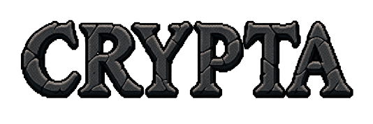

<p align="center">
  
</p>

<p align="center">
  <strong>Descend deeper. Watch your step. Think one turn ahead.</strong>
</p>

<p align="center">
  Dark Fantasy · Roguelike · Turn-Based Combat
</p>

---

**Crypta** is a single-player dark fantasy roguelike about descending into dangerous dungeons. Explore rooms, learn enemy patterns, gather supplies, and decide what you are willing to risk to reach the next floor.

Combat revolves around positioning and the order of your actions. Landing a hit matters—but so does where you will be standing when the enemy answers.

Built with **Python and Pygame Community Edition**.

## First Public Demo

**Version: v0.70.0 · Build platform: Windows**

The demo's main route covers Acts I and II, from your first steps underground to the confrontation with the Oracle.

Crypta is actively in development. Act III and its systems are experimental; their presence in the source code does not represent a finished chapter.

## Features

- **Turn-based combat.** Use movement, attacks, waiting, and abilities to control the battlefield.
- **Procedural dungeons.** Generated floors sit alongside handcrafted tutorial areas and boss arenas.
- **Three character classes.** Warrior, Rogue, and Mage offer different approaches to Act II.
- **Character progression.** Improve your attributes and choose runes that alter your class abilities.
- **Distinct enemy behaviors.** Read attack directions, avoid dangerous tiles, and manage distance.
- **Resources and difficult choices.** Potions, scrolls, fire bombs, a trader, and the Bloody Altar provide additional ways to survive.
- **Exploration.** Discover secret rooms, navigate fog of war, avoid traps, and watch out for mimics.
- **Boss encounters.** Face the Crypt Warden and the Oracle in dedicated battles.
- **Atmosphere.** Music, sound effects, animations, and transitions accompany your descent.

## The Descent

### Act I — First Steps

The dungeon introduces movement, turn order, enemy attacks, and supplies through an integrated tutorial.

Further below, the Crypt Warden awaits.

### Act II — Choose Your Class

Become a Warrior, Rogue, or Mage. Your choice changes your abilities and approach to combat.

Larger floors introduce runes, trading, consumables, traps, and the Bloody Altar. The Oracle stands at the end of this chapter.

### Act III — In Development

The next chapter is being developed around modular Tiled rooms and six character specializations.

This part of the project remains experimental.

## Controls

| Action | Input |
|---|---|
| Move | `W`, `A`, `S`, `D` or arrow keys |
| Basic melee attack | Move into an enemy's tile |
| Wait a turn | `Space` |
| Class ability | `E` |
| Use a belt item | `1`–`6` |
| Select interface elements | Mouse |
| Open menu / cancel current selection | `Esc` |
| Toggle fullscreen | `F11` |

Available actions depend on your act, class, and the current interface. Additional guidance is provided in-game.

## Play the Windows Build

1. Extract the Windows release archive.
2. Open the `Crypta` folder.
3. Launch `Crypta.exe`.

The packaged build does not require a separate Python installation.

Keep the entire game folder together. The executable needs its accompanying libraries and `resources.pak`.

The game starts in fullscreen mode. Switch to windowed mode through Settings or by pressing `F11`.

## Persistent Progress

On Windows, the highest act reached and the selected main menu theme are stored in:

```text
%LOCALAPPDATA%\Crypta\progress.json
```

This file is stored separately from the game installation. An unfinished run cannot currently be resumed after closing the game.

## Run from Source

The following commands are intended for PowerShell. Run them from the project root.

Create a virtual environment:

```powershell
python -m venv venv
```

Install dependencies:

```powershell
.\venv\Scripts\python.exe -m pip install -r requirements.txt
```

Start the game:

```powershell
.\venv\Scripts\python.exe main.py
```

During normal development, the game loads resources directly from `assets`.

## Build for Windows

Install the build tools:

```powershell
.\venv\Scripts\python.exe -m pip install pyinstaller pillow
```

Package the game resources:

```powershell
.\venv\Scripts\python.exe build_resources.py
```

This creates `release/resources.pak`.

Before building the executable, test loading resources from the archive:

```powershell
.\venv\Scripts\python.exe main.py --packed-resources
```

Build the application:

```powershell
.\venv\Scripts\python.exe -m PyInstaller --clean Crypta.spec
```

The completed build is placed in `dist/Crypta`.

Repack the resources after changing assets. Rebuild the application after changing game code.

## Project Structure

| Path | Purpose |
|---|---|
| `main.py` | Application startup and main game loop |
| `acts/` | Act-specific logic and presentation |
| `game/` | Game state, events, and progression |
| `systems/` | Combat, actions, and enemy behavior |
| `worldgen/` | Dungeon generation |
| `presentation/` | Shared interface, rendering, audio, and startup screens |
| `assets/` | Development assets |
| `resource_store.py` | Resource loading from loose files or the archive |
| `build_resources.py` | Resource archive generation |
| `Crypta.spec` | PyInstaller build configuration |

The `build`, `dist`, and `release` directories are generated locally and excluded from version control.

## Feedback

If you encounter a bug, please open an issue and include:

- The game version.
- Your act, class, and the circumstances of the issue.
- Steps to reproduce it.
- A screenshot or the complete error message, if available.

Feedback on difficulty, interface readability, and enemy behavior is also welcome.

---

**Created by Gasan Akhmedkhanov.**

Thank you for descending into Crypta.